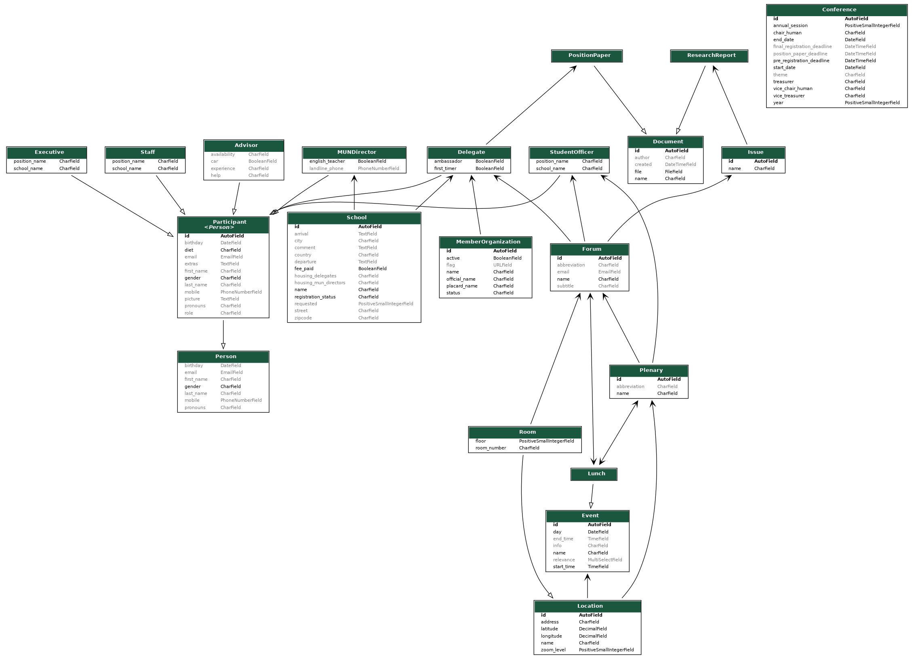

# Conference Management System Backend

This repo organizes the backend of a Conference Management System for Model UN conferences. It aimes to allow smoothless registration and administration of participants, allocation of delegations and general management of a conference.

## Development Instructions

At the moment this project uses Python 3.9.0 and Django 3.1.13. It is recommended to create a virtual environment inside the `envs` folder, e.g. by using [venv](https://docs.python.org/3/tutorial/venv.html).

To install the requirements after cloning the code and activating the environment (e.g. `source envs/my-env/bin/activate`), run

> pip install -r requirements.txt

To start the django project in a server type

> python manage.py runserver

To update the requirements according to your virtual environment, use

> pip freeze > requirements.txt

## Models Diagram

This diagram demonstrates the models and their fields and relationships.

To generate a diagram from all models excluding the internal classes use

> python manage.py graph_models -a -t original -g --hide-edge-labels -X AbstractBaseSession,Session,User,AbstractBaseUser,PermissionsMixin,AbstractUser,Group,Permission,ContentType,LogEntry -o api_visualization.png

This requires `graphviz` to be installed, e.g. by using `conda install grpahviz`.

## Initial data / Test data

As the database is empty in the beginning and filling it manually is a lot of work, two helper functions can be used:

1. A set of initial data entries for data, that will most likely be used at every conference, e.g. member organizations and forums, is provided in the `testdata` directory. Simply load it as a [fixture](https://docs.djangoproject.com/en/4.0/howto/initial-data/#providing-initial-data-with-migrations) with

   > python manage.py loaddata testdata/forums.json

2. As the participants always change, fake participants can be generated for testing purposes. Use the custom commands in `management/commands/...`, e.g.

   > python manage.py setup_test_delegate -n 20

   The `-n` or `--number` parameter is optional and specifies how many of this type shall be generated. To populate the database with all types, use

   > python manage.py setup_test_data

## Deployment...

### ...for testing

In `cms/settings.py`

- add your domain to `ALLOWED_HOSTS = []`
- add media (fonts, images) to `media` folder

### ...for production

In addition to testing deployment: In `cms/settings.py` set

- `DEBUG = False`
- security key to a secure key that only you know
