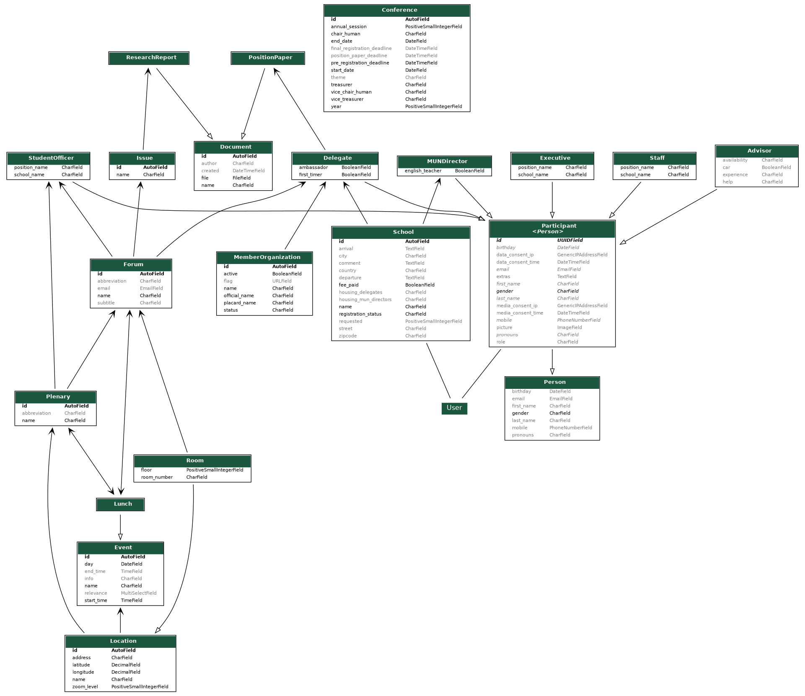

# Conference Management System Backend

This repo organizes the backend of a Conference Management System for Model UN conferences. It aims to allow smooth registration and administration of participants, allocation of delegations and general management of a conference.

## Development Instructions

At the moment this project uses Python 3.8+ and Django 4.2.22 (LTS). It is recommended to create a virtual environment inside the `envs` folder, e.g. by using [venv](https://docs.python.org/3/tutorial/venv.html).

To install the requirements after cloning the code and activating the environment (e.g. `source envs/my-env/bin/activate`), run

> pip install -r requirements.txt

To start the django project in a server type

> python manage.py runserver

To update the requirements according to your virtual environment, use

> pip freeze > requirements.txt

## Models Diagram

This diagram demonstrates the models and their fields and relationships.

To generate a diagram from all models excluding the internal classes use

> python manage.py graph_models api -t django2018 --hide-edge-labels -R --arrow-shape vee -o api_visualization.png

This requires `pygraphviz` to be installed, e.g. by using `pip install pygraphviz`. Depending on your [operating system](https://pygraphviz.github.io/documentation/stable/install.html) `graphviz` needs to be installed additionally, e.g. with `brew` or `apt`.

## Initial data / Test data

As the database is empty in the beginning and filling it manually is a lot of work, two helper functions can be used:

1. A set of initial data entries for data, that will most likely be used at every conference, e.g. member organizations, locations, forums and plenaries, is provided in the `test_data` directory. Simply load it as a [fixture](https://docs.djangoproject.com/en/4.0/howto/initial-data/#providing-initial-data-with-migrations) with

   > python manage.py loaddata test_data/plenaries.json

   > python manage.py loaddata test_data/forums.json

   > python manage.py loaddata test_data/locations.json

   > python manage.py loaddata test_data/member_organizations.json

2. Based on this initial data (from 1.) you can generate fake schools and participants for testing purposes. Use the custom commands in `management/commands/...`, e.g.

   > python manage.py setup_test_delegates -n 200

   or

   > python manage.py setup_test_staffs -n 50

   The `-n` or `--number` parameter is optional and specifies how many of this type shall be generated. If nothing is specified a sensible default number will be used. To populate the database with all types, use

   > python manage.py setup_test_data

3. Create a conference item with the corresponding data in the Django Admin interface. In particular the `start_date` is essential, as it will be used to determine ages and the countdown.

## Deployment...

Most configuration options can be set with an environment file. An example can be found in `.env.example`. Copy this, rename it to `.env`, and adjust it to your local setting. These variables are then read for example in `cms/settings.py`.

### ...for testing

In your .env file

- add your domain to `ALLOWED_HOSTS`, e.g. `ALLOWED_HOSTS='mydomain.org my.second.domain.org'`. Note that a list can be given separated by whitespaces
- add your domain to both `CORS_ORIGIN_WHITELIST` and `CSRF_TRUSTED_ORIGINS`, e.g. `CORS_ORIGIN_WHITELIST='https://mydomain.org'`. Note that here the protocol is also specified. Again, lists can be given by separating multiple entries with a white space.
- set `DEBUG=True`

Furthermore

- add media (fonts, images) to `media` folder, which is served independently under `mydomain.org/media/`
- add test data .json files if you want to populate your DB with them

### ...for production

In addition to testing deployment: In your production `.env` file set

- `DEBUG=False`
- `SECURITY_KEY` to a secure key that only you know
- `USE_X_FORWARDED_HOST=True` and `FORCE_SCRIPT_NAME='/cms'` if you don't want to serve under root domain URL, but under something like `mydomain.org/cms`

Serve static files by running `python manage.py collectstatic` which generates a `static/` folder that includes the CSS, JS and image files. It needs to be copied and served independently under `mydomain.org/static`. If the styling is missing, it might be a hint that the static files aren't loaded correctly.

Perform migration of the database by running `python manage.py migrate`.

If you would like to use Django Admin for managing the database entries, you have to create a super user by running `python manage.py createsuperuser`.

To setup the authentication correctly, adjust the authentication related environment variables. In particular you need to register an application in your Azure instance, as described in [this guide](https://medium.com/@kuntumallashivani/a-guide-to-msal-3-0-authentication-in-vue-3-8c364cc26f53). Read more on authentication in the [wiki](https://github.com/model-united-nations-of-luebeck/CMS-backend/wiki/Conference-Management-System-backend-wiki).

From uberspace there are instructions for setting up Django projects: [Django Guide Uberspace](https://lab.uberspace.de/guide_django/)
